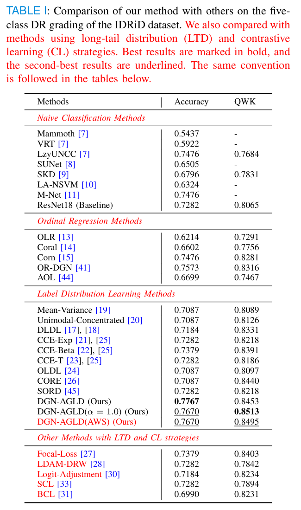

# AGNet
AGNet is a disease-grading network with asymmetric Gaussian label distribution for medical imaging.

This is the official repository for paper "Disease-grading networks with asymmetric
Gaussian label distribution for medical imaging" submitted to `IEEE TRANSACTIONS ON MEDICAL IMAGING`.

Please note that some hyper-parameters(such as learning rate, batch size, etc.) may affect the performance, which can vary among different tasks/environments/software/hardware/random seeds, and thus careful tunning is required.


## Requirements
- Linux with Python = 3.9, GeForce RTX 4090
- torch = 1.10.0
- torchvision = 0.11.0
- timm = 0.6.13
- ......

The full version can be seen in `requirements.txt`.


## Data Preparation

- Download datasets, please see `./checkpoint.md`. All datasets is placed in `./datasets`. 
- process images (only for IDRiD and Messidor) by executing this command:
```python
python gray.py {source_image} {target_image}
```

data processing code in `./datasets/gray.py`. The images from the Messidor and IDRiD datasets need preprocessing, and the processed image folder can be found in *. gray. For example, `./datasets/idrid/1.OriginalImages/a.TrainingSet.gray/`.


- split dataset (see in `./datasets/idrid/{train,valid,test}.txt`, `./datasets/messidor/splits/`)

Please place the dataset in the provided format.


## To Train

Download pretrained model parameters, and placed in the folder`./checkpoint`/. Please see `./checkpoint.md`.

- single task
```bash
bash run_idrid_single.sh
```

- joint task
```bash
bash scripts/run_idrid_joint.sh
```

You can see more options from
```python
python train_cls.py -h
```


## Performance

- single task

|   |
| :-------------------------------: |
| Single grading on the IDRiD dataset |


- joint task
|  |
| :-------------------------------: |
| Joint grading on the IDRiD dataset |


## Citing AGNet

If you find this repository useful for your research, please consider citing the paper (waiting for review results).
```
@article{tang2025disease,
  title={Disease-grading networks with asymmetric Gaussian label distribution for medical imaging},
  author={Tang, Wenqiang and Yang, Zhouwang},
  journal={},
  volume={},
  pages={},
  year={2025},
  publisher={submitting IEEE TMI}
}
```

